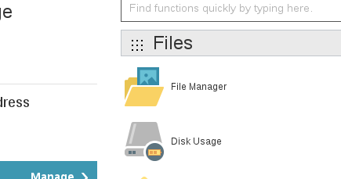
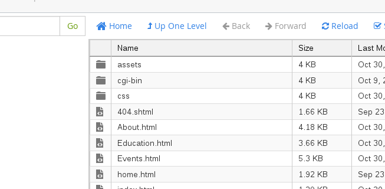
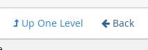
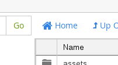

Part One: Navigating the Cpanel Website

**If at any point you accidentally navigate to the wrong page, just click up in the website bar and go to the CPanel login site again. It should be something like [thenameofyourwebsite].com/cpanel**

1. We will be using the tool called "Cpanel". It's just a website that allows you to edit other websites.

1. Log into the Cpanel site.

1. Once you've logged in, you'll see a lot of icons on the main page. There's only **one** that we are concerned with: "File Manager". You do not need to click on any other icon.

1. Click on the "File Manager" icon.

  

1. A small window will pop up and ask which directory you would like to open. The default choice should be "Web Root (public_html/www)". If "Web Root" isn't selected, select it. Then click "Go".

1. You should now see a page with a list of files and folders. These files and folders are what makes up your website.

  

1. If you double-click on a **folder**, you will go into that folder.

1. If you double-click on a **file**, you download the file.

1. There's no reason to download any files, so try to only double-click on folders! If you accidentally download a file, don't worry --- it won't hurt anything.

1. After you've navigated into a folder, you can exit that folder by using either the "Up One Level" button or the "Back" button.

  

1. If you're not sure how to return to the main list of folders and files, just click the "Home" button.

  

Congrats! You now know the basics of navigating the Cpanel site! We are half the way done with the tutorial! In the next section we will cover how to open a file for editing and making changes.
- [x] Navigating Cpanel
- [ ] Modifying Files in Cpanel
