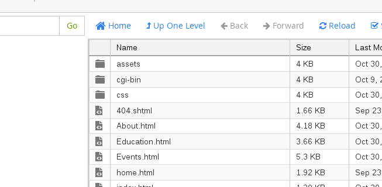
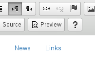

Part Two: Modifying Website Files in Cpanel

**This section assumes you've already read through part one. Please review part one if you have any questions about navigation on the Cpanel site.**

1. If you aren't already on the File Manager main page, navigate there. You should see a section of the page that looks like this:

  

1. You should see another set of navigation buttons at the top of the page. We will use these buttons to modify website files.

  

1. Side Note: The three icons that highlighted by default (+File +Folder and Upload) are not buttons that we need to worry about right now. They are only used for adding additional pages to the website.

1. Let's assume we want to update or fix some of the wording on one of the pages.

1. Click once on the file you want to modify. It should highlight in blue.

  

1. Most of the icons along the top should now be clickable. Click on the "Code Editor" icon.

  

1. You will be prompted to confirm your selection. Press "Edit" to continue.

  

1. You should now see a webpage that looks very similar to a Microsoft Word document. You can click anywhere you'd like and start making changes.

1. It's best to double-check your changes by previewing how they will look on a real webpage. You can do this by clicking the "Preview" button. It will generate a temporary webpage with your changes.

  

1. Once you're ready to commit your changes, press the "Save" button in the upper left corner.

  

Congrats! You are done with the tutorial!
- [x] Navigating Cpanel
- [x] Modifying Files in Cpanel
